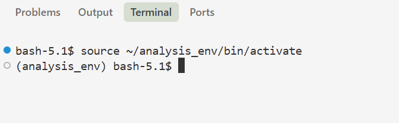

# HPC Environment Setup Guide

This manual is written for Atmospheric Science students who are using the Digital Research Alliance of Canada HPC environment, especially the Fir cluster, for the first time.

You will create two independent Python environments:

- `analysis_env` is used for Jupyter, data analysis, plotting, and processing scientific datasets such as NetCDF files with tools like xarray and Dask.
- `model_env` is used for running AI weather models with Earth2Studio. FengWu is used as the example model in this manual. Other available models can be found at [Earth2Studio Prognostic Models](https://nvidia.github.io/earth2studio/modules/models_px.html).

Complete `analysis_env` first. Make sure it works before starting `model_env`.


## 0. Files Provided

The following files are provided as shortcuts:

| File | Use |
| --- | --- |
| [`analysis_requirements.txt`](analysis_requirements.txt) | Install all packages required by `analysis_env`. |
| [`activate_analysis.sh`](activate_analysis.sh) | Load the analysis modules and activate `analysis_env`. |
| [`model_requirements.txt`](model_requirements.txt) | Record the packages in the existing `model_env`. |
| [`activate_model.sh`](activate_model.sh) | Load the model modules and activate `model_env`. |
| [`modules.txt`](modules.txt) | Record the working module stack. |
| [`run_FengWu.py`](run_FengWu.py) | Run the provided FengWu forecast and save WeatherBench2-style Zarr output. |
| [`run_FengWu.slurm`](run_FengWu.slurm) | Request a GPU compute node and run the FengWu program. |

Run commands from the folder containing these files. Do not copy another user's absolute path.

# Part I: `analysis_env`

Finish all steps in Part I before continuing to Part II.

## 1. Load the Analysis Modules

A module is software provided by the cluster. Load the Python module before creating the environment:

```bash
module --force purge
module load StdEnv/2023
module load gcc/12.3
module load python/3.11
module list
```

If a module cannot be loaded, check the available versions:

```bash
module spider python
```

Do not guess a module version.

## 2. Create `analysis_env`

Create the environment once:

```bash
virtualenv --no-download ~/analysis_env
```

Activate it:

```bash
source ~/analysis_env/bin/activate
```

The environment name should appear at the beginning of the terminal:



Check the environment:

```bash
which python
python --version
```

`which python` should point to the Python inside `analysis_env`.

## 3. Install `uv`

This manual recommends `uv` for Python package installation.

First check whether it is available:

```bash
uv --version
```

If the terminal says `uv: command not found`, install it once inside the active environment:

```bash
python -m pip install uv
uv --version
```

## 4. Install the Analysis Packages

The provided `analysis_requirements.txt` is the installation shortcut. You do not need to install the packages one by one.

Make sure analysis_env is active. Before installing packages, tell uv where to find the Python packages provided by the Alliance:

```bash
export UV_FIND_LINKS="/cvmfs/soft.computecanada.ca/custom/python/wheelhouse/$RSNT_ARCH,/cvmfs/soft.computecanada.ca/custom/python/wheelhouse/generic"
```

Install the packages and check the result:

```bash
uv pip install -r analysis_requirements.txt
uv pip check
```

Alliance configures `pip` to use its local wheelhouse. `uv` does not read `pip.conf`, so `UV_FIND_LINKS` provides the wheelhouse locations directly.

## 5. Register the Jupyter Kernel

Jupyter must know which Python environment to use.

Activate `analysis_env` with the provided shortcut:

```bash
source ./activate_analysis.sh
```

Register the kernel:

```bash
python -m ipykernel install --user \
  --name analysis_env \
  --display-name "Python (analysis_env)"
```

Check that the kernel exists:

```bash
jupyter kernelspec list
```

Open JupyterHub and select **Python (analysis_env)**.

## 6. Check `analysis_env`

Run the complete check:

```bash
source ./activate_analysis.sh

module list
which python
python --version
uv --version
uv pip check
jupyter kernelspec list
python -c "import numpy, pandas, xarray, ipykernel; print('analysis_env OK')"
```

The final line should be:

```text
analysis_env OK
```

`analysis_env` is now ready. You can continue to Part II.

## 7.Reuse, Add Packages, and Update `analysis_env`

In every new terminal, use the shortcut:

```bash
source ./activate_analysis.sh
```

Always use `source`. 

### Install Additional Packages

If you need an additional Python package, first make sure that the correct environment is active.

For `analysis_env`:

```bash
source ./activate_analysis.sh
```

Before installing the package, set the Alliance wheelhouse locations:

```bash
export UV_FIND_LINKS="/cvmfs/soft.computecanada.ca/custom/python/wheelhouse/$RSNT_ARCH,/cvmfs/soft.computecanada.ca/custom/python/wheelhouse/generic"
```

First check whether the package is available from the Alliance wheelhouse:

```bash
avail_wheels PACKAGE_NAME
```

If the package is available, install it from the Alliance wheelhouse:

```bash
uv pip install --no-index PACKAGE_NAME
```

If the package is not available from the Alliance wheelhouse, try the regular installation command:

```bash
uv pip install PACKAGE_NAME
```

After installing a package, check that the environment is still consistent:

```bash
uv pip check
```

Replace `PACKAGE_NAME` with the name of the package you want to install.

When possible, use packages provided by the Alliance wheelhouse first. If a package cannot be installed successfully, do not repeatedly change package versions at random. Please check the package documentation.

After adding or removing packages from `analysis_env`, you can save an updated package list:

```bash
uv pip freeze > analysis_requirements_new.txt
```

Review the new file before replacing the shared `analysis_requirements.txt`.

# Part II: `model_env`

The model environment is separate from the analysis environment. Packages installed in one environment do not automatically appear in the other.

The model_env is used for running AI weather models with Earth2Studio. This manual uses FengWu as the tested example. Other models may require different optional packages, PyTorch or CUDA versions, and system libraries. Before running another model, check that model's installation instructions and add its required dependencies to `model_env`.

> [!WARNING]
> `model_requirements.txt` is a record of the existing cluster environment. It contains cluster-specific versions and temporary build paths such as `file:///tmp`. Do not treat it as a general one-command installer on another account or cluster.

> [!NOTE]
> The FengWu setup in this repository records an environment and workflow that have been tested successfully on the target cluster. It is intended as a working example rather than a universal Earth2Studio installation guide.
>
> Package versions, module versions, GPU configuration, and cluster settings may change over time. If your cluster output differs from this guide, do not guess replacement versions. Please Check `module spider` and the official documentation.

## 8. Load the Model Modules

Start from a clean module stack:

```bash
module --force purge
module load StdEnv/2023
module load gcc/12.3
module load openmpi/4.1.5
module load python/3.11
module load arrow
module load eccodes
module load mpi4py
module list
```

CUDA is loaded by the Slurm job when the GPU model is run. A GPU test should not be performed on the login node.

## 9. Create `model_env`

Create the environment once:

```bash
virtualenv --no-download ~/model_env
```

Activate it:

```bash
source ~/model_env/bin/activate
```

Check the environment:

```bash
which python
python --version
```

`which python` should point to the Python inside `model_env`.

## 10. Install `uv` in `model_env`

Each environment has its own commands and packages. Check `uv` again after activating `model_env`:

```bash
uv --version
```

If it is not found, install it inside `model_env`:

```bash
python -m pip install uv
uv --version
```

## 11. Install the Model Packages

Install Earth2Studio with FengWu support:

```bash
uv pip install "earth2studio[fengwu]"
uv pip check
```

The `[fengwu]` part installs the optional Python dependencies required by FengWu. It does not install the optional dependencies for every Earth2Studio model. If you later use another model, read its Earth2Studio documentation and install the dependency group or additional packages required by that model.

Check the main imports:

```bash
python -c "import earth2studio, torch, onnxruntime; print('model imports OK')"
```

This is only an import check. CUDA and GPU execution must be checked through a Slurm GPU job.

## 12. Reuse and Add Packages to `model_env`

In every new terminal, use the provided shortcut:

```bash
source ./activate_model.sh
```

Check that it activated the correct environment:

```bash
which python
python --version
```

Always use `source`. Do not run `bash activate_model.sh`.

If you need to install an additional package in `model_env`, use the same procedure described in Section 7:

1. Check the package with `avail_wheels PACKAGE_NAME`.
2. Prefer `uv pip install --no-index PACKAGE_NAME` when an Alliance wheel is available.
3. If it is not available, try `uv pip install PACKAGE_NAME`.
4. Run `uv pip check` after installation.

Make sure `model_env` is active before installing the package.

> [!WARNING]
> Be careful when changing core packages in `model_env`, especially PyTorch, ONNX Runtime, CUDA-related packages, or Earth2Studio dependencies. Changing these packages may break the tested GPU environment. Ask the project administrator before upgrading or replacing them.

## 13. Understand the Provided FengWu Program

The provided [`run_FengWu.py`](run_FengWu.py) is a complete FengWu example. It performs the following tasks:

1. Checks that CUDA and an NVIDIA GPU are available.
2. Loads the default FengWu model package with Earth2Studio.
3. Uses Earth2Studio's ARCO data source for the initial conditions.
4. Starts one forecast for every day in the selected year.
5. Runs 40 forecast steps. Each step is 6 hours, giving a 240-hour forecast.
6. Removes the initial 0-hour state and converts the output to a WeatherBench2-style structure.
7. Saves one Zarr store for each initialization date.
8. Skips a date when its completed output already exists, so a later job can continue the work.
9. Creates a small Python helper for opening all daily Zarr stores as one dataset.

The two main settings are near the beginning of the file:

```python
YEAR = 2020
N_STEPS = 40
```

The provided program is configured and tested for YEAR = 2020. Running another year may require corresponding changes to the output directory, file names, and Slurm settings. Change `N_STEPS` only when a different forecast length is required.

The program uses the current user's `$SCRATCH` directory for completed output and `$SLURM_TMPDIR` for temporary files. You do not need to copy another user's storage path.

The main completed output is organized as:

```text
$SCRATCH/fengwu_outputs/fengwu_2020_daily_wb2/
```

Each daily store has a name similar to:

```text
fengwu_2020010100.zarr
```

> [!IMPORTANT]
> This program requires a GPU. Do not run it directly on the login node. Submit it through Slurm.

## 14. Run FengWu with Slurm

Use the provided [`run_FengWu.slurm`](run_FengWu.slurm) instead of writing a new Slurm file.

Before submission, open the file and check:

1. The environment activation command uses your own `model_env`.
2. The Python command uses the exact name and location of your FengWu program.
3. The requested time, memory, CPU, and GPU match your job.
4. The output filename is easy to identify.

Do not copy another user's absolute path. Each user must set their own project location.

If `run_FengWu.py` and `run_FengWu.slurm` are in the same folder, the Slurm file can use a relative command:

```bash
python run_FengWu.py
```

If the Python file is renamed, update the command in the Slurm file to use the same name.

Submit the job:

```bash
sbatch run_FengWu.slurm
```

Check the job:

```bash
squeue --me
```
View the job log directly from the file browser.

After the job starts, a log file will appear in the same directory as the Slurm script. Its name will look like:

```text
FengWu_2020_JOBID.out
```

Open this file directly to view the job output and error messages.

`JOBID` is the job number returned by `sbatch`.

To stop a running or queued job:

```bash
scancel JOBID
```
Replace `JOBID` with the job number.

## 15. Check `model_env`

The following checks are safe on the login node:

```bash
source ./activate_model.sh

module list
which python
python --version
uv --version
uv pip check
python -c "import earth2studio, torch, onnxruntime; print('model_env OK')"
```

The final line should be:

```text
model_env OK
```

Use `run_FengWu.slurm` for the final CUDA and GPU test.

# Common Errors

| Error | First Action |
| --- | --- |
| `python: command not found` | Load the required Python module. Use `module spider python` if the version is unknown. |
| `uv: command not found` | Activate the target environment, then install `uv` with `python -m pip install --no-index uv`. |
| `ModuleNotFoundError` | Run `which python`, activate the correct environment, and use `uv pip show PACKAGE`. |
| `No matching distribution` | Run `avail_wheels PACKAGE` and check the Python and package versions. |
| `file:///tmp` cannot be found | The requirement file contains a temporary build path and cannot be moved directly. |
| Jupyter uses the wrong Python | Select **Python (analysis_env)** and check `sys.executable`. |
| CUDA is unavailable on the login node | Submit a GPU job with Slurm. |
| GPU packages fail in the Slurm job | Record `module list`, `nvidia-smi`, the Python version, and package versions, then contact the administrator. |
| The job completes GPU inference but terminates unexpectedly afterward | Check your storage quota, especially `$HOME` and `$SCRATCH`. The job may fail when saving or moving output files if the available storage space is insufficient. |

# References

- [Earth2Studio Installation](https://nvidia.github.io/earth2studio/userguide/about/install.html)
- [Earth2Studio Prognostic Models](https://nvidia.github.io/earth2studio/modules/models_px.html)
- [Alliance Python](https://docs.alliancecan.ca/wiki/Python)
- [Alliance Fir](https://docs.alliancecan.ca/wiki/Fir)
- [uv Package Management](https://docs.astral.sh/uv/pip/packages/)

Module versions, wheel versions, Jupyter pages, and host names may change. If the live cluster output differs from this manual, follow `module spider`, the official cluster documentation, and the administrator's instructions.
